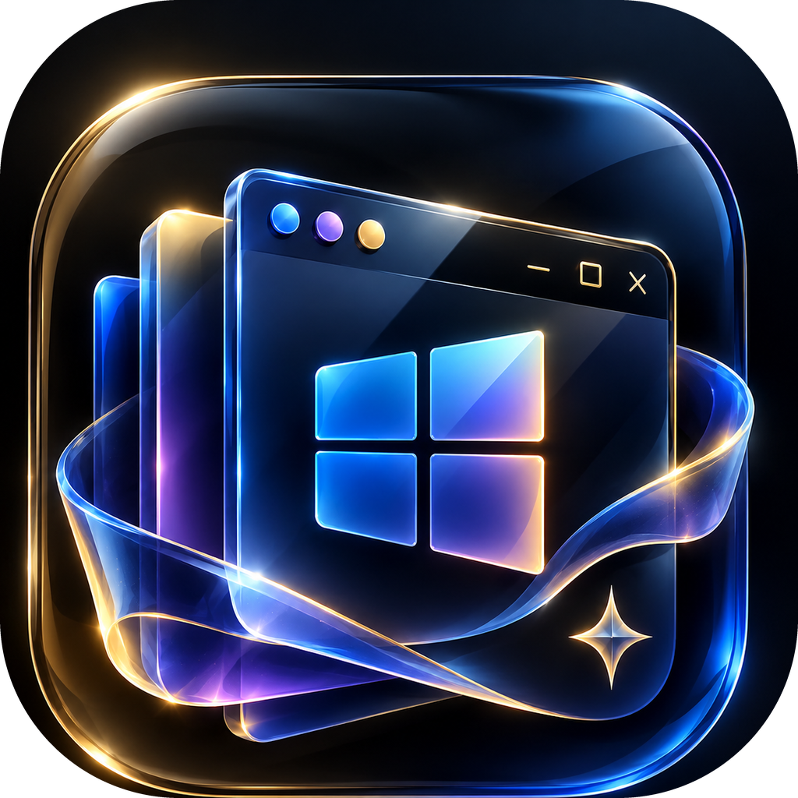
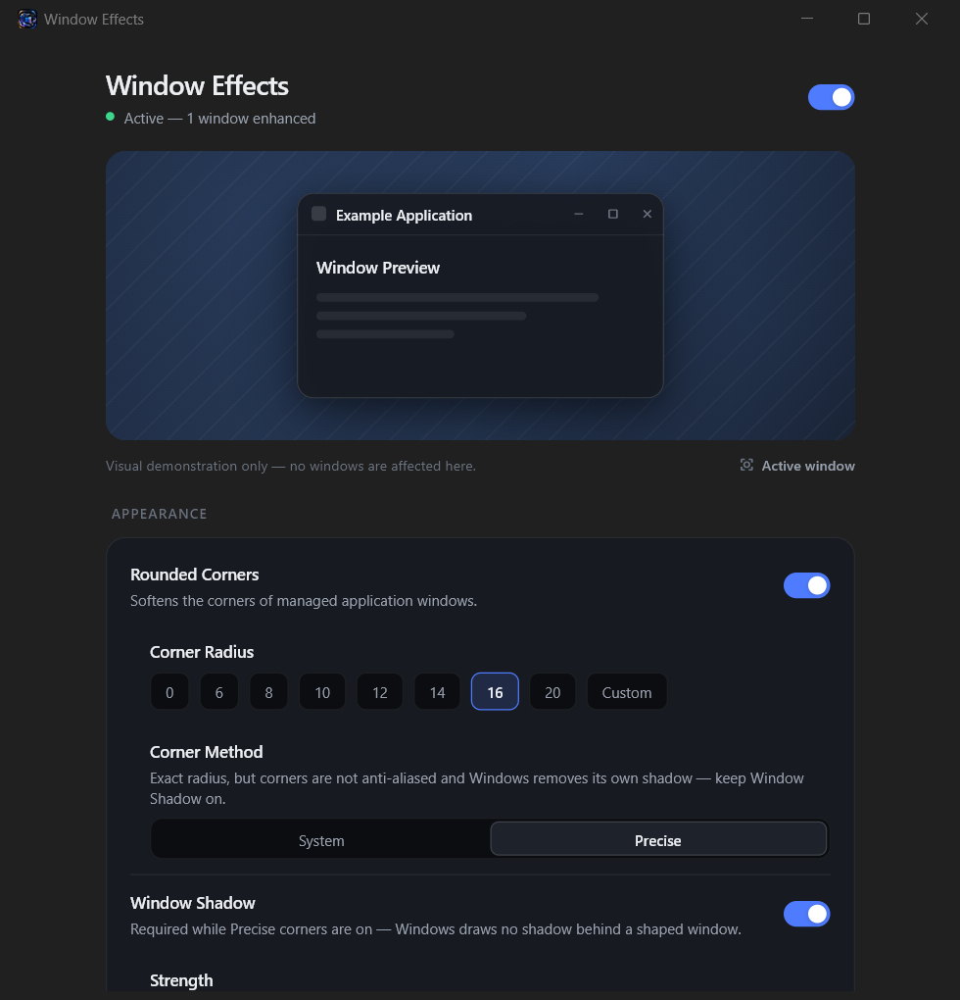

<div align="center">



# Window Effects

**Rounded corners, a considered shadow, transparency, Mica — and real opening
animations — for every window on Windows 11.**

Not a launcher, not a shell replacement. You open apps exactly as you do now;
the utility notices the windows and applies what Windows actually supports.




</div>

---

## What it does

| | |
|---|---|
| **Rounded corners** | The DWM preference where it will do, an exact window region where it will not |
| **Window shadow** | A companion shadow layer with its own strength, blur and offset — DWM's own cannot be tuned at all |
| **Transparency & blur** | Layered alpha with a theme-aware tint behind it |
| **Backdrop material** | Mica, Acrylic, or automatic, honestly refused where the build cannot do it |
| **Focus emphasis** | A stronger shadow, an accent border, optional dimming of everything else |
| **Motion** | Windows scale and fade as they open, and shrink to the taskbar as they minimise |
| **Exclusions** | Per-executable, on top of a protected list that can never be touched |

Everything is off-limits by default where it matters: the shell, the security
surfaces, and anything the classifier cannot positively identify as an ordinary
application window.

## Motion

Five styles — **macOS**, **GNOME**, **Fluent**, **Premium**, **Minimal** — each
a cubic bezier, with duration, zoom and rise adjustable underneath. The settings
screen replays the real curve on a stand-in window, so what the preview does is
what your windows do.

**Nothing moves the real window.** Every animation runs on a DWM thumbnail of it
— the same composition the taskbar preview uses — inside a click-through
overlay, while the real window waits underneath at its final size, invisible and
still taking input.

That is not the obvious design, and the obvious one was tried first: move the
window itself with `SetWindowPos` each frame. It works, and it looks bad.
Resizing a window is a request to the application to lay its content out again,
so every frame the target reflows its text, repositions its controls and
repaints — while it is already busy starting up. The animation was smooth and
the content inside it was not, which reads as lag. A thumbnail is scaled by the
compositor: the application is never asked anything, so nothing reflows.

Minimising has no choice in the matter anyway. Windows marks a window iconic
about three milliseconds after the click, before any other process can be told,
and `SetWindowPos` on a minimised window rewrites the rect it restores to. The
copy is the only thing left to animate.

Smoothness came down to three things that had nothing to do with the animation
itself: DWM's own transition playing underneath ours (switched off per window),
`GetTickCount64` advancing in 15.6 ms steps so a 16 ms frame check only passed
every other step, and the companion shadow's blur running on the same thread as
the frames. Measured after: **60 frames a second, at 0.6 ms of work each.** The
clock exists only while something is moving, so motion costs nothing at rest.

## What Windows actually allows

Read [`docs/FEASIBILITY.md`](docs/FEASIBILITY.md) before anything else. The
short version, and none of it is worked around by faking:

- **Corners are not free-form.** DWM offers exactly two rounded sizes, ~4 px and
  ~8 px. An exact 12 px corner needs a window region, which costs anti-aliasing
  *and* the system shadow. Both paths ship; the UI always reports the radius
  that will actually render, never the one you asked for.
- **DWM's shadow is not tunable.** Strength/Blur/Offset drive a companion shadow
  layer drawn by this utility.
- **Mica mostly shows in the title bar.** Applications paint their own client
  area opaquely, so the material survives where they do not paint. That
  consistent Mica title bar *is* the effect, not a limitation being hidden.
- **Acrylic can lag while dragging.** A documented Windows regression, so the
  Strong blur preset says so in the UI.
- **Elevated windows need an elevated utility.** UIPI blocks a medium-integrity
  process from restyling a high-integrity window. It fails gracefully and
  reports why.

No code injection, no DLL hooks, no screen capture. Everything goes through
`DwmSetWindowAttribute`, layered windows, DWM thumbnails and WinEvent hooks.

## Safety

Every attribute the engine changes is captured *first* and replayed on restore.
Restore runs on window destroy, engine stop, master toggle, tray pause, tray
exit and session end (`WM_ENDSESSION` — the last moment a logoff gives).
Repeated failures quarantine a window; repeated failures overall trip a latch
that restores everything and stops.

The shell and security surfaces (`explorer.exe`, `consent.exe`, `winlogon.exe`
and friends) are protected unconditionally, and the settings screen lists them
so you can see exactly what is off limits.

**Turn off all effects** in the System section restores every touched window
immediately.

## Living in the tray

- **Closing the settings window hides it.** The engine keeps running; the tray
  icon brings the window back, and *Exit* there is what actually quits — the
  path that restores every window on the way out.
- **Start with Windows** writes `"<path>" --tray` to `HKCU\...\Run`, so a login
  starts the engine quietly with no window. The switch reports what the registry
  actually says.
- **Pause** is in the tray menu and is not a setting: it suspends everything and
  restores every window without touching the saved configuration.
- **A second launch does not start a second engine.** It asks the running one to
  show its window. Two engines would each treat the other's changes as the
  original state to restore.
- **The settings window uses Mica on itself** where Windows supports it
  (build 22621+).

## Building

```powershell
flutter pub get
flutter build windows --release
```

The result is `build\windows\x64\runner\Release\window_effect.exe`. Requires the
Flutter Windows desktop toolchain (Visual Studio with the *Desktop development
with C++* workload). Zero third-party pub dependencies — tray, startup
registration, window management and motion are all native.

To run it at login, turn on **Start with Windows** in the app rather than
placing a shortcut: the Run entry carries `--tray`, which starts the engine
without opening a window.

## Architecture

```
Flutter UI → SettingsController → MethodChannel → EffectsEngine → Win32/DWM
```

One process, two threads. The effects engine runs its own message loop so
`EVENT_OBJECT_LOCATIONCHANGE` traffic never reaches the UI thread.

| Document | What is in it |
|---|---|
| [`docs/FEASIBILITY.md`](docs/FEASIBILITY.md) | The Windows API capability matrix, and every limit, measured rather than assumed |
| [`docs/ARCHITECTURE.md`](docs/ARCHITECTURE.md) | Layers, threading, the safety model, the motion pipeline, the native file layout |
| [`docs/ROADMAP.md`](docs/ROADMAP.md) | The five phases, what each contains, and what was verified on a real machine |

The Flutter host costs roughly 100 MB resident versus ~4 MB for a pure Win32
daemon. That is the honest price of a single binary with a real settings UI; CPU
while tray-resident is effectively zero, because Flutter stops producing frames
once its window is hidden.

## Configuration

`%APPDATA%\WindowEffects\config.json`, written atomically. A corrupt file resets
to the Premium preset rather than blocking startup, and a byte-order mark left
by an editor is tolerated. The engine also keeps a rolling log at
`%APPDATA%\WindowEffects\engine.log`, capped at 512 KB, which records every
decision it makes about every window.

## The icon

`assets/icon/app_icon.png` is the master artwork. The Windows icon — title bar,
Alt-Tab, taskbar and the notification area — is generated from it:

```powershell
python tool/make_icon.py
```

That writes `windows/runner/resources/app_icon.ico` at ten sizes, from 16 px to
256 px, cropping the artwork and rounding its corners so the field around the
tile becomes transparent.

## Status

Feature complete, and verified on Windows 11 build 26200: corners, shadow,
transparency, backdrop, motion, the tray menu, pause/resume, presets, startup
registration, the executable picker, launch-to-tray, the single-instance guard
and restore-on-exit were each exercised against live windows. `flutter analyze`
is clean and the release build compiles warning-free at `/W4 /WX`.

## License

No license has been chosen yet. Pick one before sharing this — without a
license, nobody else has the right to use the code.
